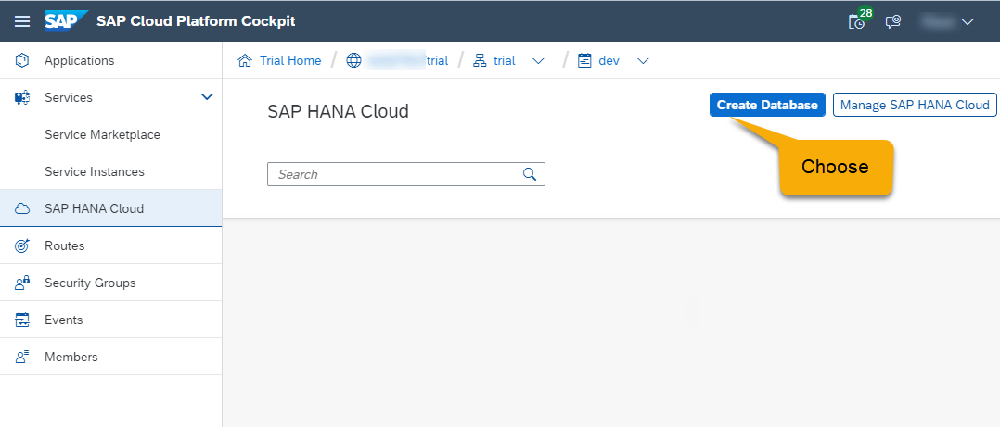
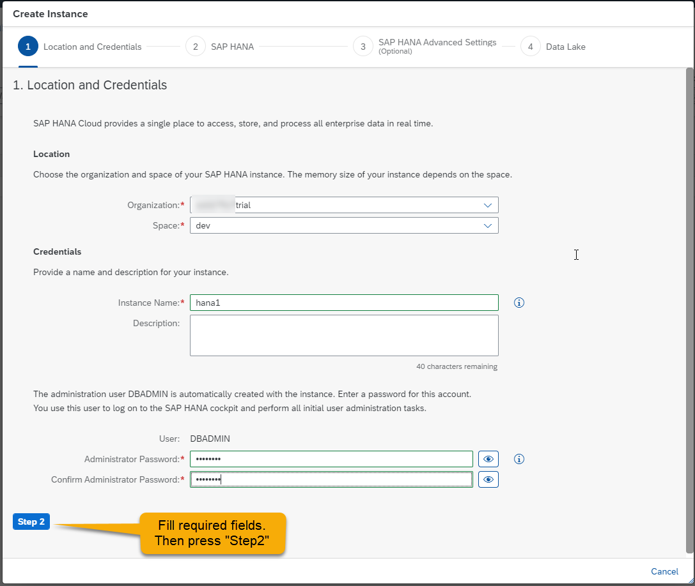
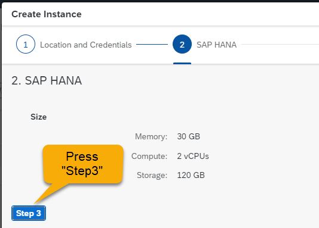
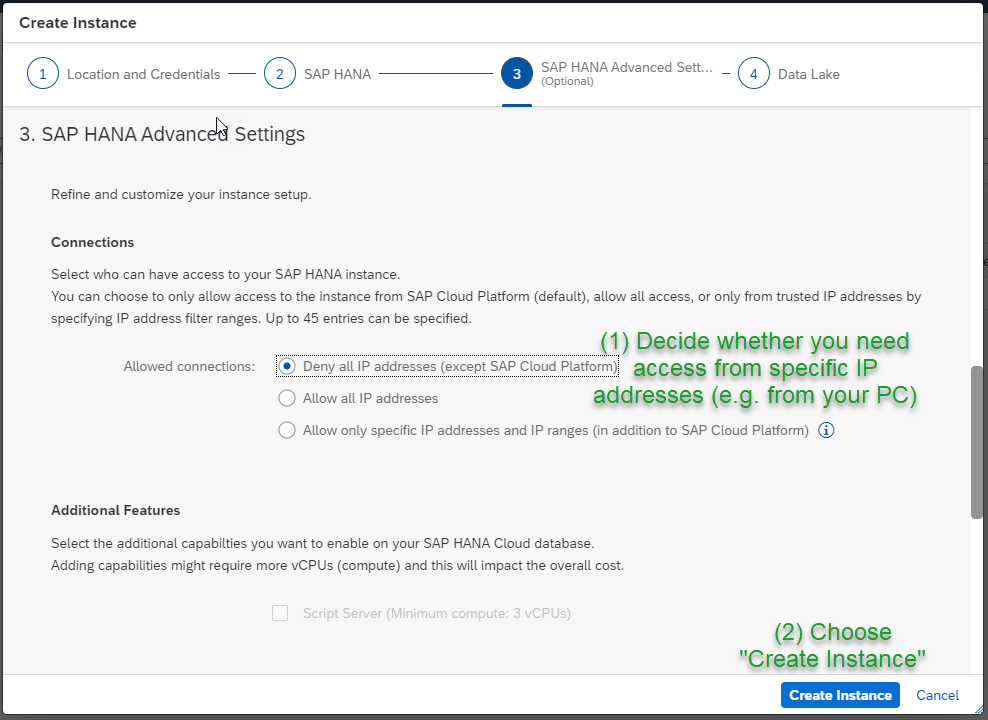

# How to work with an SAP HANA Cloud Service
+ in the Cloud Foundry Environment of SAP Cloud Platform
+ from a CAP perspective

## Get an account on SAP Cloud Platform
Either you get a paid account from SAP, or you start with a trial account. In any case, this [english page](https://www.sap.com/products/cloud-platform.html) and this [german page](https://www.sap.com/germany/products/cloud-platform.html) contains all infos and links you need to get started.

## Create an SAP HANA Cloud Service instance
An SAP HANA Cloud Service instance represents an SAP HANA Database instance. Creation works as follows (click here if you need screenshots):
+ Use SAP Cloud Platform Cockpit to navigate to one of your Cloud Foundry Spaces. In navigation pane to the left, choose "SAP HANA Cloud". Select the button "Create Database". 
+ Fill in an instance name and the administrator password. Use this password later to administrate the instance as user DBADMIN.
+ Press "Step2". You might want to change memory settings here (only for non-trial accounts). 
+ Press "Step3". Here, you have to think about IP-Addresses. If you want to connect to this instance from your local computer, you have to add the computer's IP to the "Allowed connections" list. You need this for instance, when using ``cds deploy --to hana`` on you computer.
+ Finally, press "Step 4" and/or "Create Instance". Instance creation takes while ...

## Managing SAP HANA Cloud Service instances
**On trial accounts, your SAP HANA instance is stopped each night. You have to manually restart it!** To achive this, go to the Space-view of SAP Cloud Platform Cockpit and choose "SAP HANA Cloud" in navigation pane to the left. Press the button "Manage SAP HANA Cloud" on the top right. This opens a new window/tab which lets you manage your databases.

## Sharing database instances
You can share a database instance across Cloud Foundry organizations and spaces. If you have only one database created within a subaccount, applications from all spaces of this subaccount can access it automatically. If you have multiple databases in one subaccount, you need to create a database mapping. A mapping is also needed if you want to access a database from a different subaccount. 

You create a mapping from view "Manage SAP HANA Cloud" (see above). There, click on the name of a database instance to open the mapping dialog.


## What poor Windows users have to do

### Visual Studio Build Tools
Some npm-modules are made to become natively compiled during installation. This happens for instance for the SAP HANA driver for npm. On Windows you need to install the **Visual Studio Build Tools** to let your system do such native builds. For installation, do the following:

+ Open a PowerShell as an administrator
+ Enter the command ``npm install --global --production windows-build-tools``

This will donwload approx. 3 GB of software. So be patient. If everything went right you see an ouput like this:


If you feel the process is hanging, use CRTL+C to stop it and restart the installation. You can verify the installation by using the command ``npm config ls``. This should output something like the following. The ``globalconfig`` entry on Python is essential.

```
>> npm config ls
; cli configs
metrics-registry = "https://registry.npmjs.org/"
scope = ""
user-agent = "npm/6.14.4 node/v12.16.3 win32 x64"
; userconfig C:\Users\abcde\.npmrc
registry = "https://registry.npmjs.org/"
; globalconfig C:\Users\abcde\AppData\Roaming\npm\etc\npmrc
python = "C:\\Users\\abcde\\.windows-build-tools\\python27\\
python.exe"
```

### SAP Common CryptoLib
Before being able to use the command ``cds deploy --to hana``, as a Windows user, you have to install the **SAP Common CryptoLib**. To download this library from the SAP Software Download Center, you have to have an S-User. This means you have to be an SAP Customer!

Go to https://help.sap.com/viewer/product/SAP_DATA_SERVICES/ and enter the search term "SAP CommonCryptoLib". In the result list, follow the link to "Obtaining the SAP CommonCryptoLib file in Windows and Unix". Follow the instructions there.

## Deploy to SAP HANA from your local machine
Use the command ``cds deploy --to hana`` to deploy CDS database content to a remote SAP HANA Cloud Service instance. As a prerequisite, install the [Cloud Foundry Command Line Interface](https://docs.cloudfoundry.org/cf-cli/), use ``cf login`` to connect to the relevant Cloud Foundry space and consider the prerequisites for Windows user as described above.

The ``deploy`` command will create a file ``default-env.json`` in your project which contains the credential to connect to the database ("service key"). **Don't share this file because it contains sensitive information for granting access to your database**. Don't create this file at all for productive databases.

## Screenshots of HANA Cloud Service instance creation

<br>



<br>


<br>


<br>


