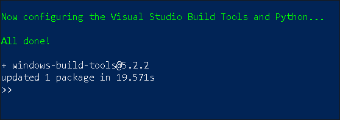

# How to connect to an SAP HANA Cloud Service with CAP

## Get an account on SAP Cloud Platform
Either you get a paid account from SAP, or you start with a trial account. In any case, this [english page](https://www.sap.com/products/cloud-platform.html) and this [german page](https://www.sap.com/germany/products/cloud-platform.html) contains all infos and links you need to get started.

## Create an SAP HANA Cloud Service instance
Use SAP Cloud Platform Cockpit to navigate to one of your Cloud Foundry Spaces. In navigation pane to the left, choose "SAP HANA Cloud". Select the button "Create Database". Fill in an instance name and the administrator password. Use this password later to administrate the instance as user DBADMIN.

Press "Step2". You might want to change memory settings here. No need to do this for trials. Press "Step3". Here, you have to think about IP-Addresses. If you want to connect to this instance from your local computer, you have to add the computer's IP to the "Allowed connections" list. You need this for instance, when using ``cds deploy --to hana`` on you computer.

Finally, press "Step 4" and/or "Create Instance". Instance creation takes while ...

## What poor Windows users have to do

### Visual Studio Build Tools
Some npm-modules are made to become natively compiled during installation. This happens for instance for the SAP HANA driver for npm. On Windows you need to install the **Visual Studio Build Tools** to let your system do such native builds. For installation, do the following:

+ Open a PowerShell as an administrator
+ Enter the command ``npm install --global --production windows-build-tools``

This will donwload approx. 3 GB of software. So be patient. If everything went right you see an ouput like this:



If you feel the process is hanging, using CRTL+C and restart the installation. You can verify the installation by using the command ``npm config ls``. This should output something like the following. The ``globalconfig`` entry on Python is essential.

```
>> npm config ls
; cli configs
metrics-registry = "https://registry.npmjs.org/"
scope = ""
user-agent = "npm/6.14.4 node/v12.16.3 win32 x64"
; userconfig C:\Users\abcde\.npmrc
registry = "https://registry.npmjs.org/"
; globalconfig C:\Users\abcde\AppData\Roaming\npm\etc\npmrc
python = "C:\\Users\\abcde\\.windows-build-tools\\python27\\
python.exe"
```

### SAP Common CryptoLib
Before being able to use the command ``cds deploy --to hana``, as a Windows user, you have to install the **SAP Common CryptoLib**. To download this library from the SAP Software Download Center, you have to have an S-User. This means you have to be an SAP Customer!

Go to https://help.sap.com/viewer/product/SAP_DATA_SERVICES/ and enter the search term "SAP CommonCryptoLib". In the result list, follow the link to "Obtaining the SAP CommonCryptoLib file in Windows and Unix". Follow the instructions there.

## Deploy from your local machine
Use the command ``cds deploy --to hana`` to deploy CDS database content to a remote SAP HANA Cloud Service instance.
